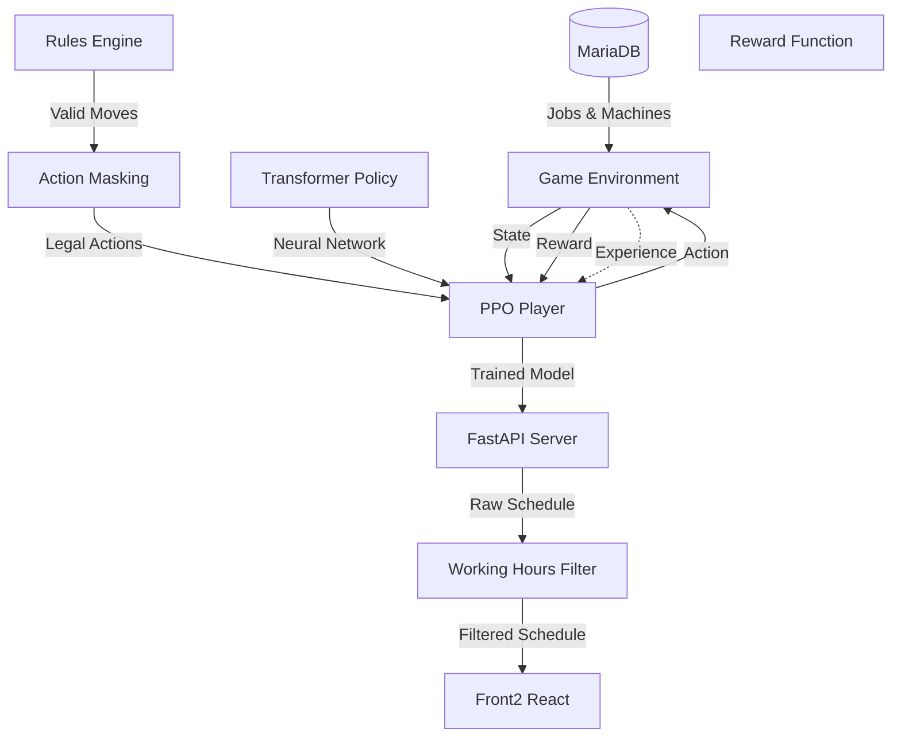

# PPO Scheduling System - Workflow Documentation

## System Overview

The PPO scheduling system uses deep reinforcement learning to optimize production scheduling. This document outlines the complete workflow from data ingestion to schedule visualization.

**Current Status**: Phase 4 Strategy Development Created. Phase 3 training revealed RL limitations (best: 56.2% vs 80% target). Created 4 strategy environments for focused testing. Ready for Phase 4 training.

## Pure DRL Scheduling Workflow (Updated Architecture)



## Constraint Categories

### Hard Constraints (Environment Physics)
1. **Sequence Within Family**
   - Jobs like "1/4", "2/4", "3/4" must execute in order
   - Enforced through `is_available` state

2. **Machine Requirements**
   - Jobs MUST use machines specified in `Machine_v`
   - Single: "80" → occupies machine 80
   - Multiple: "57,64,65,66,74" → occupies ALL 5 machines simultaneously
   - No alternatives allowed

3. **No Time Overlap**
   - A machine cannot process multiple jobs simultaneously
   - Multi-machine jobs block ALL their required machines

### Soft Constraints (Learned Through Rewards)
1. **Meet Deadlines** - Higher reward for on-time completion
2. **Prioritize Important Jobs** - Bonus for `IsImportant=1` jobs
3. **Efficiency** - Minimize total makespan
4. **Load Balancing** - Distribute work evenly

### Deployment Constraints (Applied at Runtime)
- **Working Hours** - Only schedule during factory operating hours
- Applied as post-processing filter, not part of training

## Data Processing Pipeline

### 1. Data Extraction from MariaDB
```
tbl_jo_txn + tbl_jo_process → Raw Job Data
              ↓
    Calculate Processing Time:
    If CapMin_d = 1 and CapQty_d > 0:
        hours = (JoQty_d / (CapQty_d * 60)) + (SetupTime_d / 60)
              ↓
    Parse Machine Requirements:
    Machine_v = "57,64,65,66,74" → required_machines = [57,64,65,66,74]
              ↓
    Create Job Object with all constraints
```

### 2. Environment State Representation
```
For each job:
- is_available: Can it be scheduled? (sequence check)
- urgency_score: How close to deadline?
- processing_time: Duration in hours
- is_important: Priority flag
- required_machines: List of ALL machines needed

For each machine:
- is_occupied: Currently processing?
- time_until_free: When available?
- current_job: What's running?
```

### 3. Action Space & Masking
```
Action = (job_index, primary_machine_index)

Valid only if:
- Job is available (sequence satisfied)
- ALL required machines are free
- No constraint violations

When action taken:
- Block ALL required machines
- Update machine schedules
- Mark job as scheduled
```

## Training Workflow

### Phase 1: Data Pipeline
- Implement correct processing time formula
- Parse multi-machine requirements
- Connect to production database

### Phase 2: Environment Setup
- Handle multi-machine occupation
- Remove working hours (training assumes 24/7)
- Implement proper action masking

### Phase 3: Model Architecture
```
Input: Variable number of jobs (10-1000+)
         ↓
Job Features Extraction (6 features per job)
         ↓
Machine Features Extraction (3 features per machine)
         ↓
Global State Features (5 features)
         ↓
MLP Policy Network
         ↓
Policy Head → Action probabilities
Value Head → State value estimate
```

### Phase 4: Curriculum Learning (16 Stages)
```
Foundation Training (Stages 1-4): ✅ TESTED
- Toy environments: 5-15 jobs, 3-8 machines
- Uses REAL job IDs (JOAW, JOST, JOTP) and machine names
- Results: toy_easy 100%, toy_normal 56.2%, toy_hard 30%, toy_multi 36.4%
- Gap to 80% target revealed RL limitations

Strategy Development (Stages 5-8): ✅ CREATED (Phase 4)
- Small scale: 20 jobs, 10-12 machines (adjusted from data availability)
- Four focused scenarios:
  - Small Balanced: General scheduling test
  - Small Rush: Urgent deadline handling
  - Small Bottleneck: Resource constraint management  
  - Small Complex: Multi-machine job coordination
- Custom reward structures per scenario
- All using REAL production data subsets

Scale Training (Stages 9-12): 📋 PENDING
- Medium to large scale: 80-109 jobs, 40-100 machines
- Depends on Phase 4 results

Production Mastery (Stages 13-16): 📋 PENDING
- Full scale: 109 jobs, 145 machines
- Requires successful smaller scale training
```

## Deployment Workflow

### 1. Inference Pipeline
```
Receive job request → Load trained model
                   → Create environment
                   → Run PPO inference
                   → Get raw schedule (24/7)
                   → Apply working hours filter
                   → Return valid schedule
```

### 2. Working Hours Filter
```python
# Post-process schedule for actual factory hours
for scheduled_job in raw_schedule:
    if not in_working_hours(scheduled_job.start_time):
        shift_to_next_valid_window(scheduled_job)
```

## Key Improvements from Previous Version

1. **Multi-Machine Understanding**: Jobs can require multiple machines simultaneously
2. **Correct Processing Time**: Using capacity-based formula from production
3. **Working Hours Separation**: Training on 24/7, filtering at deployment
4. **No Hardcoded Strategies**: Pure learning from experience
5. **100% Real Production Data**: All training uses actual job IDs and machine names from MariaDB
6. **Fixed Reward Structure**: Completion bonuses prevent "do nothing" behavior
7. **Machine ID Mapping**: Handles non-sequential database IDs correctly

## Phase 3 Findings & Lessons Learned

### What Worked
- Simple PPO achieved 56.2% on toy_normal (best result)
- Environment correctly handles real production data
- Multi-machine job scheduling functions properly
- Training infrastructure stable and scalable

### What Failed (Made Performance Worse)
1. **Action Masking**: 25% (vs 56.2% baseline)
   - Lost action space structure when flattening
2. **Reward Engineering**: Negative rewards, 0% scheduling
   - Model preferred doing nothing over risk
3. **Schedule All Environment**: 31.2%
   - Model memorized sequences, got stuck on invalid actions
4. **Simple Penalty Reduction**: 12.5%
   - Model repeatedly tried invalid actions

### Root Causes Identified
- Only ~10% of random actions are valid
- Sequential dependencies create cascading constraints
- Some jobs have impossible deadlines (158h work, 144h deadline)
- Model gets stuck trying invalid actions after completing families
- Pure RL struggles with combinatorial optimization

### Phase 4 Response
Created focused strategy environments to test specific scheduling challenges:
- Balanced workloads vs resource constraints
- Urgent deadlines vs complex dependencies
- Each with tailored reward structures
- Progressive difficulty to identify RL capabilities

## Performance Monitoring

### Training Metrics
- Episode rewards
- Constraint violations (should → 0)
- Average makespan
- On-time delivery rate

### Production Metrics
- Schedule generation time (<1 second)
- Real on-time delivery rate
- Machine utilization rates
- Comparison with current scheduler

## Emergency Procedures

### Model Failure
- Log error with full context
- Return error response (no fallback)
- Alert operations team
- NO mock schedulers or degraded mode

### Performance Issues
- Monitor inference time
- Check constraint satisfaction
- Validate data pipeline
- Consider retraining if needed

---

*This workflow represents pure deep reinforcement learning scheduling where all strategies emerge from experience, with production constraints respected through proper environment design.*